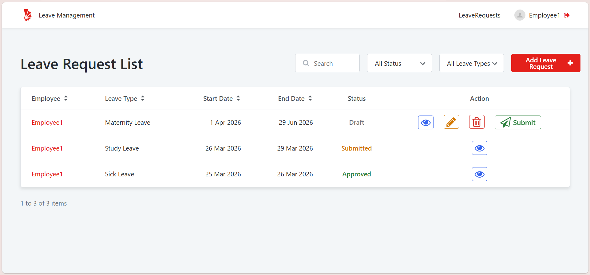
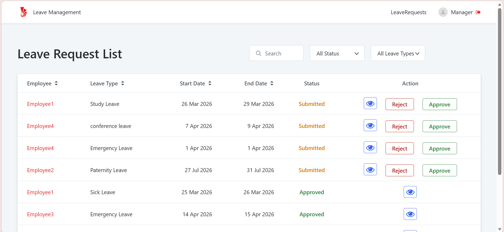
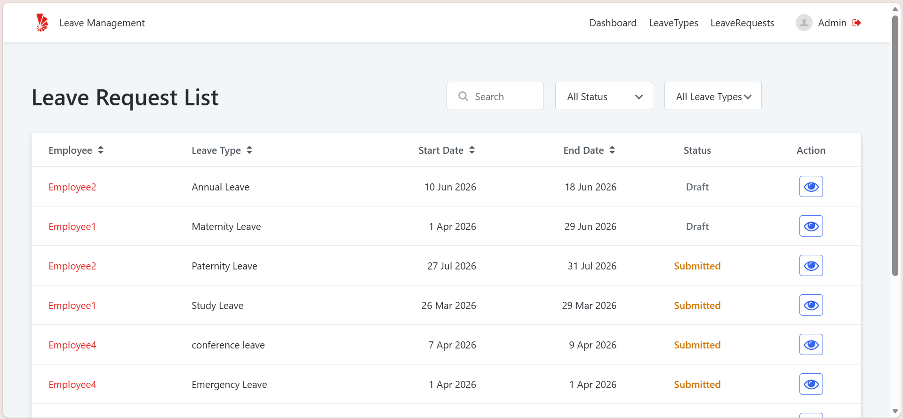
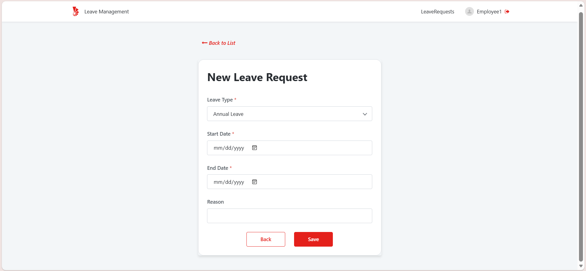
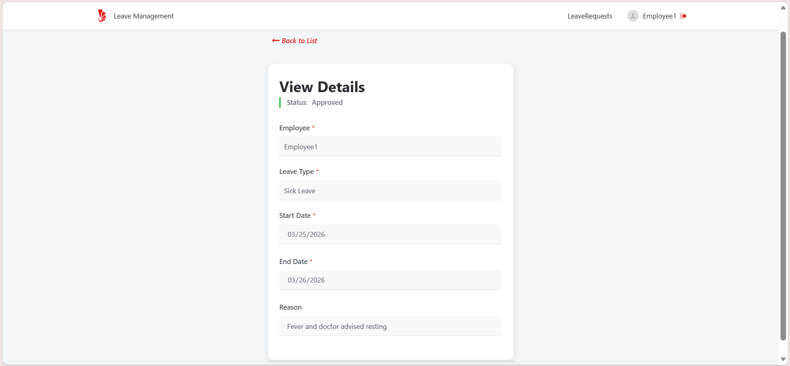
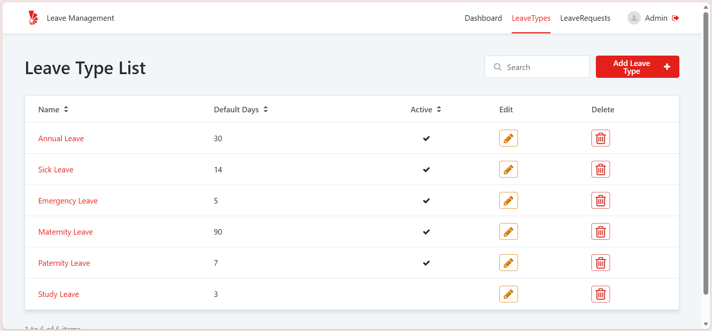
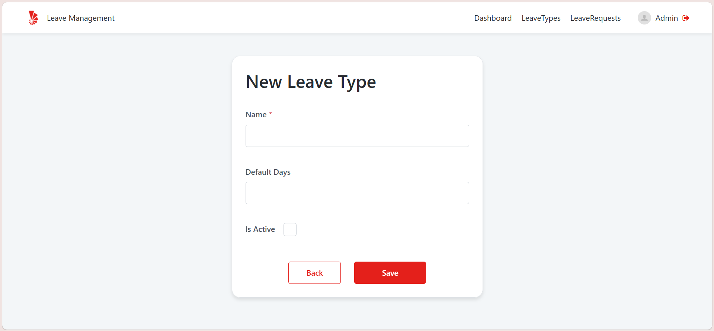
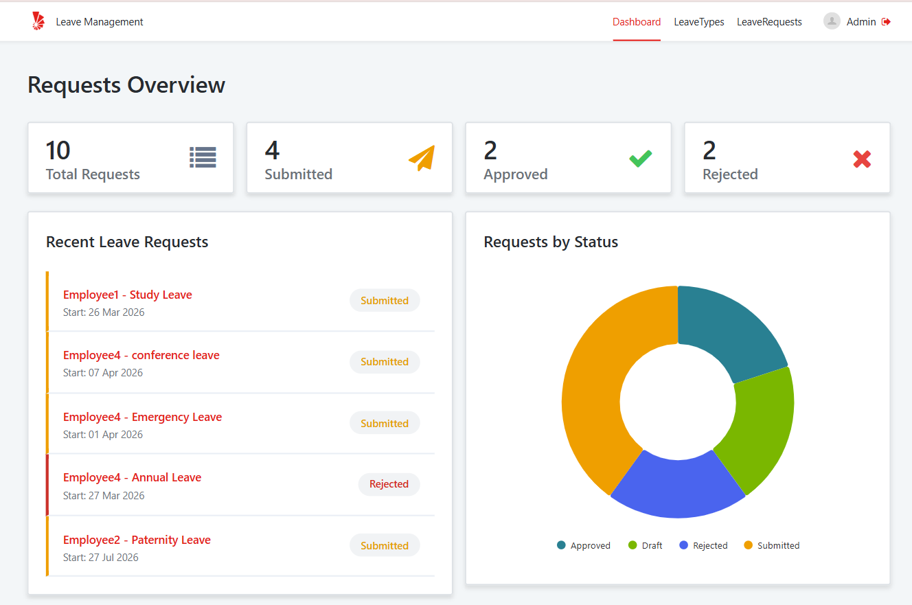
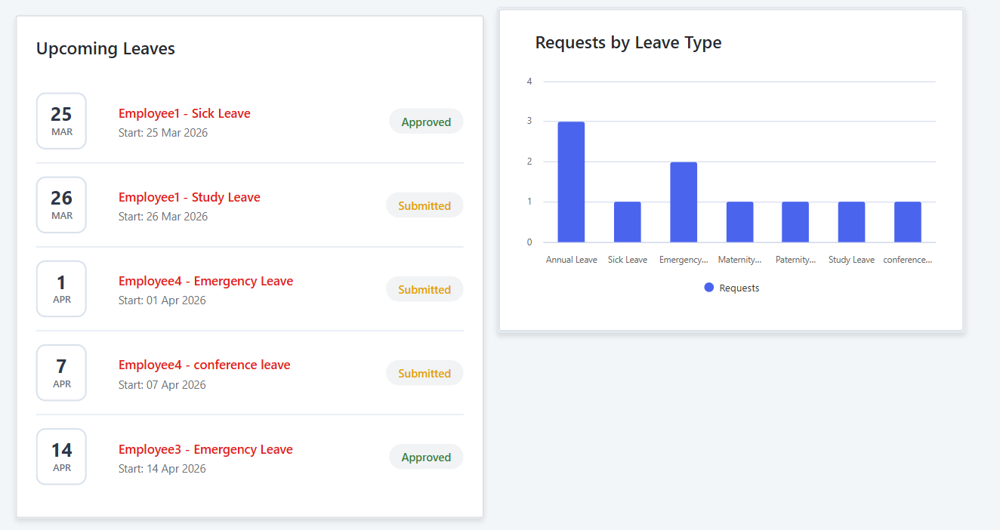

# Rihal - Low Code Codestaker Challenge

**Roziya Shahin Al-Balushi** - roziyashahin3@outlook.com

# Leave Management System

A Reactive Web application built in OutSystems to manage employee leave requests with role-based access for Employees, Managers, and Admins.

## Overview

This project was developed for the OutSystems Leave Management System challenge. It supports the full leave request process, from creating and saving drafts to submitting, approving or rejecting requests, and monitoring through admin dashboards.

The system includes three roles:

- **Employee:** create, edit, submit, and track personal leave requests.
- **Manager:** review team requests and approve or reject submitted requests.
- **Admin:** manage leave types, monitor all requests, and view dashboards.

The solution was built to meet the challenge requirements for entities, relationships, validations, security, and dashboards.

The application can be accessed using the link below:  
[Leave Management system]([https://personal-kniwn3ie.outsystemscloud.com/LeaveManagementSystem1/Login])

## Demo Credentials

| Role | Username | Password |
|------|----------|----------|
| Admin | Admin | demo1234 |
| Manager | Manager | demo1234 |
| Employee | Employee1 | demo1234 |
| Employee | Employee2 | demo1234 |
| Employee | Employee3 | demo1234 |
| Employee | Employee4 | demo1234 |

## Validations

- Leave type and start date are required.
- End date cannot be before start date.
- Start date cannot be before today.
- Friday and Saturday are treated as weekends and are not allowed as leave dates.
- Total leave days must be greater than 0.
- Employees can edit or delete only draft requests.
- Employees can submit only draft requests.
- Managers can approve or reject only sumbitted requests.
- Leave type name is required and must be unique.
- Default days must be 0 or greater.
- Inactive or deleted leave types are hidden from request dropdowns.
- Historical requests remain preserved even if a leave type becomes inactive or deleted.

## Screens & Features

### Employee

- Create new leave requests
- Save requests as Draft
- Edit or delete draft requests
- Submit requests for manager review
- View personal leave history
- Search and filter requests
- Open request details in read-only mode

### Manager

- View submitted employee requests
- Review request details
- Approve or reject submitted requests
- Manage requests based on status

### Admin

- Create, update, deactivate, and soft-delete leave types
- View all leave requests
- Search and filter requests
- View dashboard statistics and summaries

## Leave Requests List Screen

### Employee’s Perspective

- Can view Request information including Employee, Leave Type, Start Date, End Date and Status.
- Action buttons include View, Edit, Delete or Submit Request.
- Can Edit or Delete in Draft Status only.
- More details including Reason can be viewed by clicking the view button (eye-icon button).
- Can search by Employee Name, filter by Status and Leave Type.
- The table is ordered by Leave Status starting with drafts, submitted, approved then rejected.
- Employees can add new leave requests.

### Manager’s Perspective

- Manager Can Reject/Approve a Leave Request that is in Submitted Status.
- Manager can’t see drafts, but can view all other status.

### Admin’s Perspective

- Admin can only view the leave requests including drafts.

## New/Edit Leave Request Screen

- Only Employees can Create/Edit their own requests.
- Leave Type, Start Date and End Date are required in the form.
- Only Active Leave Types can be selected.
- Deleted Leave Types are not shown in the Dropdown menu.
- Start Date can only be today onwards.
- End Date can’t be before Start Date.
- Start and End Date can’t be on weekends (Friday and Saturday).

## View Details Leave Request Screen

- Employees, Manager, and admin can view request details.
- Can view Employee’s Name, Leave Type, Start Date, End Date, Reason and Request Status.

## Leave Type List Screen

- Only Admin can create, edit, and delete Leave Types.
- Can view Leave Type’s Name, Default Days, and Active Status.
- Action Buttons allow admins to Edit or Delete (Soft delete) the Leave Types.
- Can Search the Leave Type’s Name.

## New/Edit Leave Type Screen

- Name is a required field and must be unique.
- Default days must be 0 or greater.

## Dashboard Screen

- Only Admin can access Dashboard Screen.
- Recent Requests include the most recently created leave request and shows Employee Name, Leave Type, Start Date and its current Status.
- Upcoming Leaves show the leaves that are coming up soon and include only submitted and approved leaves.
- Pie Chart displays Requests filtered by status, and Bar Chart displays number of requests of each Leave Type.
- By clicking on the name of the Employee in Recent Requests/Upcoming Leaves, it navigates to the View Details Leave Request Screen.

